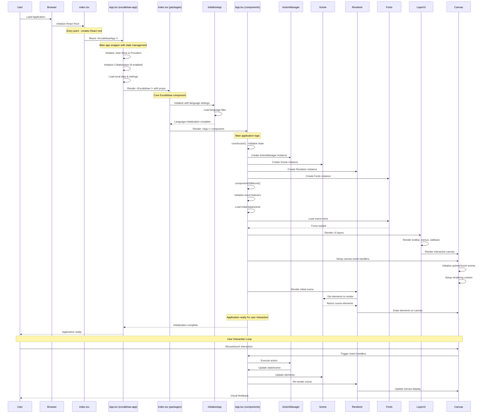

# Understanding Excalidraw Codebase
## Sequence Diagram of Operational Flow

```mermaid
sequenceDiagram
    participant User
    participant Browser
    participant AppIndex as index.tsx
    participant ExcalidrawApp as App.tsx (excalidraw-app)
    participant ExcalidrawBase as index.tsx (packages)
    participant InitializeApp
    participant AppComponent as App.tsx (components)
    participant ActionManager
    participant Scene
    participant Renderer
    participant Fonts
    participant LayerUI
    participant Canvas

    User->>Browser: Load Application
    Browser->>AppIndex: Initialize React Root
    
    Note over AppIndex: Entry point - creates React root
    AppIndex->>ExcalidrawApp: Mount <ExcalidrawApp />
    
    Note over ExcalidrawApp: Main app wrapper with state management
    ExcalidrawApp->>ExcalidrawApp: Initialize Jotai Store & Providers
    ExcalidrawApp->>ExcalidrawApp: Initialize Collaboration (if enabled)
    ExcalidrawApp->>ExcalidrawApp: Load local data & settings
    
    ExcalidrawApp->>ExcalidrawBase: Render <Excalidraw /> with props
    
    Note over ExcalidrawBase: Core Excalidraw component
    ExcalidrawBase->>InitializeApp: Initialize with language settings
    InitializeApp->>InitializeApp: Load language files
    InitializeApp-->>ExcalidrawBase: Language initialization complete
    
    ExcalidrawBase->>AppComponent: Render <App /> component
    
    Note over AppComponent: Main application logic
    AppComponent->>AppComponent: constructor() - Initialize state
    AppComponent->>ActionManager: Create ActionManager instance
    AppComponent->>Scene: Create Scene instance
    AppComponent->>Renderer: Create Renderer instance  
    AppComponent->>Fonts: Create Fonts instance
    
    AppComponent->>AppComponent: componentDidMount()
    AppComponent->>AppComponent: Initialize event listeners
    AppComponent->>AppComponent: Load initial data/scene
    AppComponent->>Fonts: Load scene fonts
    Fonts-->>AppComponent: Fonts loaded
    
    AppComponent->>LayerUI: Render UI layers
    LayerUI->>LayerUI: Render toolbar, menus, sidebars
    LayerUI->>Canvas: Render interactive canvas
    
    AppComponent->>Canvas: Setup canvas event handlers
    Canvas->>Canvas: Initialize pointer/touch events
    Canvas->>Canvas: Setup rendering context
    
    AppComponent->>Renderer: Render initial scene
    Renderer->>Scene: Get elements to render
    Scene-->>Renderer: Return scene elements
    Renderer->>Canvas: Draw elements on canvas
    
    Note over AppComponent: Application ready for user interaction
    AppComponent-->>ExcalidrawApp: Initialization complete
    ExcalidrawApp-->>User: Application ready
    
    Note over User,Canvas: User Interaction Loop
    User->>Canvas: Mouse/touch interaction
    Canvas->>AppComponent: Trigger event handlers
    AppComponent->>ActionManager: Execute action
    ActionManager->>AppComponent: Update state/scene
    AppComponent->>Scene: Update elements
    AppComponent->>Renderer: Re-render scene
    Renderer->>Canvas: Update canvas display
    Canvas-->>User: Visual feedback
```

